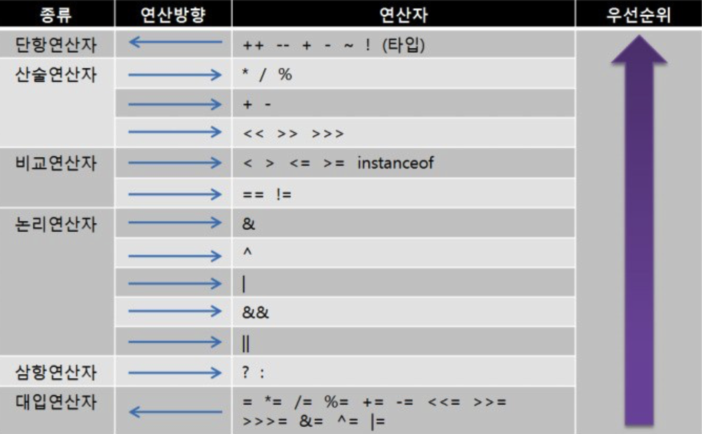

# Chapter03_Operator

---

- 연산자
    
    → 연산자란 “연산을 수행하는 기호”를 말한다.
    
    → 연산자와 피연산자로 식을 구성한다.
    
    ▪️연산자 : 연산을 수행하는 기호
    
    ▪️피연산자 : 연산자와 작업 대상
    
    → 연산자는 연산을 수행하고 나면 항상 결과값을 반환한다.
    
    ▪️연산자 우선순위
    
    
    
    출처 : [https://cremazer.github.io/java-Types-of-Operators/](https://cremazer.github.io/java-Types-of-Operators/)
    
    1. 산술 > 비교 > 논리 > 대입. 대입은 제일 마지막에 수행된다.
    2. 단항 > 이항 > 삼항. 단항 연산자의 우선순위가 이항 연산자보다 높다.
    3. 단항 연산자와 대입 연산자를 제외한 모든 연산의 진행방향은 왼쪽에서 오른쪽이다.
    
    ▪️산술 변환
    
    ```java
    // 1. 두 피연산자의 타입을 같게 일치시킨다. (보다 큰 타입으로 일치)
    long + int -> long + long -> long
    float + int -> float + float -> float
    double + float -> double + double -> double
    
    // 2. 피연산자의 타입이 int보다 작은 타입이면 int로 변환된다.
    byte + short -> int + int -> int
    char + short -> int + int -> int
    
    ```
    
    1. 자동 형변환에서 본 것처럼 피연산자의 갑손실을 최소화하기 위한 것
    2. 정수형의 기본 타입인 int가 가장 효율적이므로 위와 같이 사용. 오버플로우 방지
        
        → int(5) / int (2) = 2인 이유도 타입을 int로 맞춰야 하기 때문에 버림이 발생
        
    - 단항 연산자
        - 증감 연산자 ++, --
            
            → 식에 두 번 이상 포함된 변수에 증감연산자를 사용하는 것은 혼란을 줄 수 있다.
            
    - 산술 연산
        - 사칙 연산 +, -, *, /
            
            → 타입이 다를 시, 형변환이 일어난다.
            
            → 정수를 0으로 나눴을 때, ArithmeticException 발생
            
            → 정수를 0.0으로 나눴을 때, infinity 출력
            
            → 문자(char)는 해당 문자의 유니코드(부호없는 정수)로 바뀌어 저장되므로 문자간의 사칙연산은 정수간의 연산과 동일하다. [문자 타입 오류 예시](src/main/java/chapter03/OperatorEx02.java)
            
            → 나머지 연산자는 나누는 수로 음수를 허용하지만 부호는 무시되므로 결과는 음수의 절대값으로 나눈 나머지와 결과가 같다.
            
    - 비교 연산자
        - 대소 비교
            
            → boolean형을 제외한 나머지 자료형에 다 사용할 수 있지만 참조형은 제외
            
        - 등가 비교
            
            → 등가 비교 시 형변환에 의한 값 손실을 주의하자.
            
        - 문자열 비교
            
            → 문자열 비교는 == 연산자 대신 equal() 함수를 사용해야 한다.
            
            → Heap Area에 생기는 String 객체와 Literal pool에 생기는 값은 다르기 때문이다.
            
            → 대소문자를 구별하지 않고  비교하고 싶다면, equals()대신 equalsIgnoreCase()를 사용
            
        
    - 논리 연산자
        - &&, ||
            
            → &&가 ||보다 우선순위가 높다.
            
            → x>10 && x < 20 보단 가독성을 위해 10<x && x < 20 사용
            
            ▪️효율적인 연산이 가능하다.
            
            → 부울 연산을 보면 ‘x가 true면, x || y는 항상 true이다.’
            
            → ‘x가 false면, x && y는 항상 false이다.’
            
            → 위를 이용해 더 빠른 연산 결과를 얻을 수 있다.
            
        - 비트 연산자( &, ^, |, >>, << )
            
            → x << n 은 x*2^n과 결과와 같다.
            
            → x >> n 은 x/2^n과 결과와 같다.
            
    - 그 외 연산자
        - 조건 연산자( ? : )
            
            → 조건식 ? 식1 : 식2으로 이루어지며, true시 식1을 false시 식2를 결과로 내준다.
            
        - 대입 연산자
            
            → Lvalue = Rvalue
            
            → 대입연산자의 Rvalue는 변수뿐만 아니라 식이나 상수 등이 모두 가능한 반면, Lvalue는 반드시 변수처럼 값을 변경할 수 있는 것이여야 한다. 그래서 Lvalue엔 리터럴이나 상수같이 값을 저장할 수 없다.
