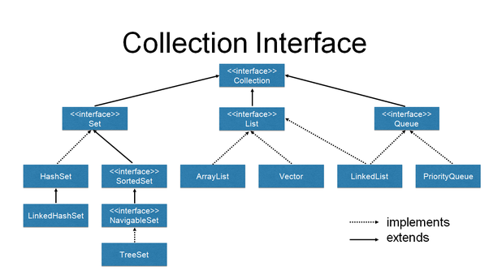

# Chapter11_Collections

---

- Collections Framework이란
    
    → 데이터 군을 저장하는 클래스들을 표준화한 설계
    
    ▪️큰 분류로 3가지 컬렉션 클래스
    
    → List, Set, Map
    
    - List
        
        → 순서가 있는 데이터의 집합, 데이터의 중복을 허용한다.
        
    - Set
        
        → 순서를 유지하지 않는 데이터의 집합, 데이터의 중복을 허용하지 않는다.
        
    - Map
        
        → 키와 값의 쌍으로 이우어진 데이터의 집합, 순서는 유지되지 않으며, 키는 중복을 허용하지 않고, 값은 중복을 허용한다.
        

---

- Collection interface
    
    → 컬렉션 클래스에 저장된 데이터를 읽고, 추가하고 삭제하는 등의 컬렉션을 다루는데 가장 기본적인 메서드들을 정의하고 있다.
    

---

- ArrayList
    
    → ArrayList는 중복을 허용하면서 저장순서가 유지되는 컬렉션을 구현하는데 사용된다.
    
    → 기존 Vector를 개선한 것으로 배열에 더 이상 저장할 공간이 없다면 큰 배열을 생성해 저장된 내용을 새로운 배열로 복사한 다음에 저장한다.
    
    💬 용량을 변경해야할 때는 새로운 배열을 생성한 후 기존의 배열로부터 새로 생성된 배열로 데이터를 복사해야하기 때문에 상당히 효율이 떨어진다.
    
    → 모든 종류를 ArrayList에 담을 수 있다.
    
- LinkedList
    
    → 접근 시간이 가장 빠르다. 그치만 크기를 변경할 수 없고 비순차적인 데이터의 추가 또는 삭제에 시간이 많이 걸린다.
    
    → 다루고자 하는 데이터의 개수가 변하지 않는 경우라면, ArrayList가 최상의 선택이 되겠지만, 데이터 개수 변경이 잦다면 LinkedList를 사용하는 것이 더 나은 선택이다.
    

🍎 따라서, 순차적으로 데이터를 추가 삭제하는 Stack은 ArrayList와 같은 배열 기반의 클래스를 데이터의 삭제가 빈번한 Queue은 LinkedList로 구현하는 것이 더 적합하다.

---

- Iterator, ListIterator, Enumeration
    
    → Collection에 저장된 요소를 접근하는데 사용되는 인터페이스이다.
    
    → Enumeration은 Iterator의 구버전이며, ListIterator는 Iterator의 기능을 향상시킨 것이다.
    
    → ListIterator는 Iterator에 양방향 조회기능추가 (List를 구현한 경우만 사용가능)
    
    → Iterator는 재사용이 안되므로, 다시 얻어와 사용해야 한다.
    
    ```java
    boolean hasNext() // 읽어올 요소가 남아있는지 확인, 없다면 false
    Object next() // 다음 요소를 읽어온다.
    void remove() // 요소 삭제
    ```
    

🍎 StringBuffer의 append는 결과값으로 StringBuffer를 리턴한다.

---

- Arrays
    
    → 배열을 다루는데 유용한 메서드들이 존재한다.
    
    🔗 [https://docs.oracle.com/javase/7/docs/api/java/util/Arrays.html](https://docs.oracle.com/javase/7/docs/api/java/util/Arrays.html) 
    

---

- Comparator, Comparable
    
    → Arrays.sort()는 사실 Comparator, Comparable의 구현에 의해 정렬되었던 것
    
    → Comparable을 구현한 클래스는 정렬이 가능하다는 것을 의미한다.
    
    Comparable : 기본 정렬기준을 구현하는데 사용
    
    Comparator : 기본 정렬기준 외에 다른 기준으로 정렬하고자할 때 사용
    

---

- HashSet
    
    → Set 인터페이스를 구현한 컬렉션이며, 중복된 요소를 저장하지 않는다.
    
    → 객체 생성 시 같은 맴버 변수를 가진 상태에서 set collection에 넣는다면 중복을 허용하는 값이 나온다.
    
    이를 해결하기 위해 생성되는 객체에 equals(),  hashCode() 변수를 Override 해야한다.
    
    🍏 내가 몰랐던 equals(), hashCode()의 존재 이유
    
    ▪️Equals() and hashCode()
    
    → equals 메서드를 이용한 비교에 의해서 true를 얻은 두 객체에 대해 각각 hashCod()를 호출해서 얻은 결과는 반드시 같아야 한다.
    
    → equals 메서드를 호출했을 때 false를 반환하는 두 개게는 hashCode() 호출에 대해 같은 int 값을 반환하는 경우가 있어도 괜찮지만, 해싱(hashing)을 사용하는 collection의 성능을 향상시키기 위해서는 다른 int값을 반환하는 것이 좋다.
    
    🍎 서로 다른 두 객체에 대해 equals()로 비교한 결과가 true인 동시에 hashCode()의 반환값이 같아야 같은 객체로 인식한다.
    
    → **따라서**, 새로운 클래스를 정의할 때 equals()를 재정의 오버라이딩해야 한다면 hashCode()도 같이 재정의해서 equals()의 결과가 true인 두 객체의 해시코드의 결과 값이 항상 같도록 해주어야 한다.
    
    → **그렇지 않으면**, HashMap과 같이 해싱을 구현한 컬렉션 클래스에서는 equal()의 호출 결과가 true지만 해시코드가 다른 두 객체를 서로 다른 것으로 인식하고 따로 저장할 것이다.
    
    🍎 두 객체의 해시코드가 같다고 해서 equals 메서드의 호출 결과가 반드시 true여야 하는 것은 아니다.
    

---

- TreeSet
    
    → 자료구조의 형태로 데이터를 저장하는 컬렉션 클래스이다.
    
    → Set으로 만들어진 자료구조로 중복된 데이터의 저장을 허용하지 않으며 정렬된 위치에 저장하므로 저장순서를 유지하지도 않는다.
    
    → Tree 자료구조는 범위검색에 효율이 좋다.
    
    🍎 TreeSet이 Array 보다 검색, 정렬 기능이 뛰어난 이유
    
    → Array는 정렬과 검색을 할 시에 새로운 배열에 값을 추가로 할당해 시간이 많이 걸린다. 반면 TreeSet은 정렬된 상태를 처음부터 유지해 검색과 정렬 속도가 빠르다.
    
    🍎 entrySet, keySet
    
    → Map에서 key, value가 모두 필요한 경우, entrySet을 사용한다.
    
    → key만 필요한 경우 keySet을 사용한다.
    
    → iterator를 통해 value를 하나씩 가져와 사용할 수 있다.
    

---

- HashMap, HashTable
    
    → HashMap을 사용하자. 해싱을 사용하기 때문에 많은 양의 데이터를 검색하는데 있어서 뛰어난 성능을 보인다.
    
    → HashMap은 키와 값을 각각 Object type으로 저장한다.
    
    🍎 해싱과 해시함수
    
    → 해싱이란 해시함수를 이용해서 데이터를 해시테이블에 저장하고 검색하는 기법을 말한다.
    
    → 저장할 데이터의 키를 해시함수에 넣으면 배열의 한 요소를 얻게 되고, 다시 그 곳에 연결되어 있는 링크드 리스트에 저장하게 된다.
    

---

- Properties
    
    → Properties는 HashMap의 구버전인 HashTable의 개선 버전으로 HashTable이 <Object, Object>로 저장하는 반면 <String, String>으로 저장 가능한 컬렉션이다.
    
    → 시스템 속성을 가져다 사용할 때 효율이 좋다.
    

---

- Collection

❗Collection은 Interface고 Collections는 클래스이다. 주의

▪️컬렉션 동기화

→ Multi-Thread 프로그래밍에서는 하나의 객체를 여러 쓰레드가 동시에 접근할 수 있기 때문에 데이터의 일관성을 유지하기 위해서는 공유되는 객체에 동기화가 필요하다.

→ Collection은 변경불가 컬렉션(unmodifiable), 싱글톤, 한 종류의 객체만 저장하는 컬렉션을 만들 수 있다.

⇒ 컬렉션에 저장할 요소의 타입을 제한하는 것은 다음 장에서 배울 Generics로 간단하게 처리할 수 있는데도 이런 메서드들을 제공하는 호환성 때문이다.

