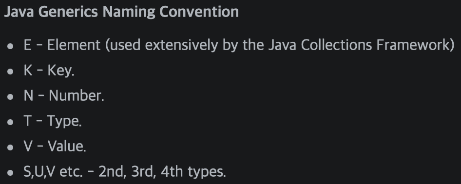

# Chapter12_Generics

---

- Generics?
    
    → 한국말로 “포괄적인”, ”일반적인” 의미를 갖고 있다.
    
    → 클래스 내부에서 사용할 데이터 타입을 나중에 인스턴스를 생성할 때 확정하는 것을 말한다.
    
    → Code의 중복 제거와 Type 안정성을 갖기 위해 탄생했다.
    
    → Generics란 다양한 타입의 객체들을 다루는 메서드나 컬렉션 클래스에 **컴파일 시의 타입 체크**를 해주는 기능이다.
    
    → 객체의 타입을 컴파일 시에 체크하기 때문에 객체의 타입 안정성을 높이고 형변환의 번거로움이 줄어듦
    
    ▪️장점
    
    1. 타입 안정성을 제공
    2. 타입체크와 형변환을 생략할 수 있으므로 코드가 간결해진다.

```java
Box<T> // Generics class. T의 Box or T Box라고 읽는다.
T // 타입 변수 or 타입 매개변수
Box // 원시 타입(raw type)
```

→ 지네릭스는 인스턴스별로 다르게 동작하도록 하도록 만든 기능이다.

→ static 맴버는 인스턴스 변수를 참조할 수 없다. static 맴버는 타입 변수에 지정된 타입, 즉 대입된 타입의 종류에 관계없이 동일한 것이어야 한다. // static과 맴버 변수 다시 공부

🍎 왜 지네릭 배열을 사용할 수 없는가?

→ new연산자 때문에 사용할 수 없다. new 연산자는 컴파일 시점에 타입 T가 뭔지 정확히 알아야 하는데 클래스 컴파일 시점에서는 T가 어떤 타입이 될지 전혀 알 수 없다.

→ 그럼에도 불구하고 사용하려면, Reflection API의 newInstance()를 사용 or Object 배열을 생성해 복사 후 T[]로 형변환 하는 방법을 사용

→ extends를 사용하면, 특정 타입의 자손들만 대입할 수 있게 제한할 수 있다.

→ Generics에선 특이하게 인터페이스를 구현해야 한다는 제약이 필요하다면 implements가 아닌 extneds를 사용한다.

---

- 와일드 카드
    
    → 지네릭 타입이 다른 것만으로는 오버로딩이 성립하지 않는다. 지네릭 타입은 컴파일러가 컴파일할 때문사용하고 제거. 따라서 타입 변수를 다르게 메서드를 재정의한다면 오버로딩이 아닌 “메서드 중복 정의”이다.
    

```java
<? extends T> // 와일드 카드의 상한 제한. T와 그 자손들만 가능
<? super T> // 와일드 카드의 하한 제한. T와 그 조상들만 가능
<?> // 제한 없음. 모든 타입이 가능하다.
```

→ 와일드 카드를 어렵게 생각하지 말고 Class<T> 를 확장시킬 수 있게 만들어진 것이라 생각하자.

사용은 interface, class 상관 없이 extends로 사용 가능하다.

→ 와일드 카드를 사용하려면<? extends T> 와일드 카드를 사용하기 전에 따로 특정 클래스를 만들어 어떤 타입을 지정할 것인지 나타내줘야 한다.

```java
static Juice makeJuice(FruitBox<? extends Fruit> box>){}
class FruitBox<T extends Fruit> extends Box<T>{}
class Box<T> {}
```

---

- Generic Method
    
    → 지네릭 클래스에 정의된 타입 매개변수와 지네릭 메서드에 정의된 타입 매개변수는 전혀 별개의 것이다.
    

```java
class FruitBox<T> {
	static <T> void sort(List<T> list, Comparator<? super T> C)
} // 관계 없는 것
```

---

